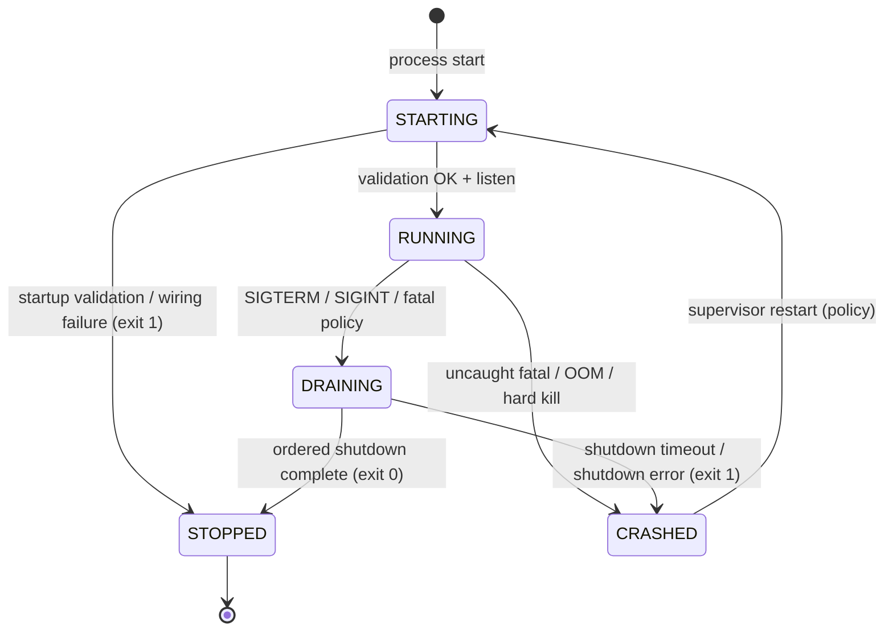
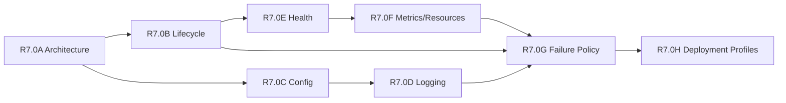

# R7.0A — Production Readiness Architecture

**Status:** Architecture only (no implementation)  
**Scope:** Operational architecture for continuous production operation of the WheelWin server  
**Non-goals:** Gameplay changes, deployment execution, redesign of Server Authoritative / console projection / gateway protocols

---

## 0. Principles

| Priority | Rule |
|----------|------|
| 1 | **Gameplay correctness** always outranks availability. |
| 2 | The process must **never continue in an undefined state**. |
| 3 | When recovery is impossible, the server must **fail safely** (ordered shutdown, exit ≠ 0). |
| 4 | **Developer Console** remains operational during failures whenever the process is still running. |
| 5 | Production ops **extends** the current system; it does not replace SimulationLoop, EventBus, RecoveryEngine, payment path, or console projection/gateway contracts. |

### Baseline (already present)

| Capability | Location |
|------------|----------|
| Process entry + ordered `shutdown()` | `server/app.js` (`WheelWinApplication`) |
| SIGINT / SIGTERM → graceful shutdown | `server/app.js` |
| Startup validation | `server/config/startupValidation.js` |
| Env / production flags | `server/config/*.js`, `server/.env.example` |
| Owner secrets file | `config/owner.json` (gitignored) via `OwnerConfiguration` |
| Health snapshot | `GET /health` → `HealthService` |
| In-process metrics | `MetricsService`, `OperationalMetrics` |
| Plain log levels | `LoggerService` |
| Reconnect / in-process recovery | `RecoveryEngine`, `RecoverySnapshotCache` |
| Developer Console + JWT gate | R6.0C–E, R6.1 |

### Explicit gaps this stage defines (not implements)

- Crash handlers (`uncaughtException` / `unhandledRejection`) and restart policy
- Structured logging, rotation, correlation IDs on log lines
- Split liveness / readiness / dependency health
- Event-loop delay & memory-pressure signals
- External monitoring export (beyond console projections)
- Process-manager / staging / production packaging contracts
- Durable cross-restart operational state (out of scope for R7.0A detail; noted as later)

---

## 1. Production Architecture Overview

WheelWin remains a **single Node.js process** running Server Authoritative gameplay. Production readiness adds an **operations shell** around that process:

```text
                    ┌─────────────────────────────────────────┐
                    │         Process Supervisor (host)       │
                    │   start / restart / signals / logs      │
                    └──────────────────┬──────────────────────┘
                                       │
                    ┌──────────────────▼──────────────────────┐
                    │          WheelWinApplication            │
                    │  config → validate → wire → listen      │
                    │                                         │
                    │  ┌─────────────┐  ┌──────────────────┐  │
                    │  │ Gameplay    │  │ Operations Plane │  │
                    │  │ Simulation  │  │ Health / Metrics │  │
                    │  │ Rooms/Games │  │ Logging          │  │
                    │  │ Payments    │  │ Console REST+WS  │  │
                    │  │ Sockets     │  │ Failure policy   │  │
                    │  └─────────────┘  └──────────────────┘  │
                    └─────────────────────────────────────────┘
```

**Separation of planes**

| Plane | Responsibility | Failure posture |
|-------|----------------|-----------------|
| **Gameplay** | Correct simulation, payments, sockets | Prefer stop game / reject start over wrong outcome |
| **Operations** | Health, logs, metrics, console | Prefer stay up so operators can see failure |
| **Host** | Restart, log ship, secrets inject | Restart only after safe exit or crash |

Gameplay must not depend on ops exporters. Ops may read gameplay state (as console projections already do) but must not mutate it.

---

## 2. Process Lifecycle

### 2.1 States

| State | Meaning |
|-------|---------|
| `STARTING` | Config load, validation, wiring; not accepting gameplay traffic |
| `RUNNING` | HTTP + Socket.IO listening; simulation loop active |
| `DRAINING` | Shutdown begun; health degraded; no new work preferred |
| `STOPPED` | Clean exit (code 0) |
| `CRASHED` | Unexpected exit (code ≠ 0) or hard abort |

### 2.2 Operational lifecycle diagram



### 2.3 Startup sequence (extend existing)

Order already embodied in `WheelWinApplication.start()` — preserve; document as contract:

1. Load env (`dotenv`) + config modules (`server`, `production`, `rooms`, `ton`, `socket`, phases, developer auth).
2. Load immutable owner configuration (`OwnerConfiguration` / `config/owner.json`).
3. Run `validateStartupConfiguration` / engine dependency checks — **fail fatally** on inconsistency.
4. Construct logger, metrics, health, EventBus, managers, engines, simulation, sockets, payment monitors.
5. Register console projection + gateway + auth (R6).
6. Bind HTTP (`/health`, gameplay HTTP if any, `/console/*`).
7. Listen; mark health startup complete; emit operational “ready” signal (future readiness endpoint).

**Rule:** No partial listen. If step N fails, do not leave sockets accepting players.

### 2.4 Running

- SimulationLoop, BlockchainMonitor, console push intervals, phase timers all owned by application components.
- Configuration loaded at startup is **immutable for the process lifetime** (restart to change).
- Developer Console may observe and (later) trigger ops actions that do not rewrite gameplay rules.

### 2.5 Graceful shutdown (extend existing `shutdown()`)

Preserve current ordered teardown; formalize phases:

1. Mark `HealthService.markShuttingDown()` → health `degraded`.
2. Publish `SERVER_SHUTDOWN` on EventBus (existing).
3. Stop accepting new Socket.IO connections / drain where practical.
4. Stop simulation loop and cancel timers/intervals (existing component `shutdown()`).
5. Close payment / blockchain adapters.
6. Close HTTP server and Socket.IO.
7. Flush logs / metrics snapshot (future R7 logging stage).
8. Exit 0.

**Shutdown budget:** define a hard timeout (roadmap R7.0B). Exceeding budget → exit 1 (fail safe, do not hang forever).

### 2.6 Restart

| Trigger | Behavior |
|---------|----------|
| Planned | SIGTERM → graceful → supervisor starts new process |
| Config change | Restart required (immutable runtime config) |
| Recoverable soft failure | Log + console alert; **no** auto-restart of process |
| Fatal / undefined state | Safe shutdown or crash → supervisor restart |

In-process session recovery (`RecoveryEngine`) is **not** a substitute for process restart. After restart, in-memory games are gone unless a later durable stage exists.

### 2.7 Crash recovery

| Layer | Responsibility |
|-------|----------------|
| Process | Catch unhandled rejection / uncaught exception → classify → log → safe shutdown or exit |
| Supervisor | Restart with backoff; cap restart storms |
| Gameplay | Clients use existing reconnect protocol against **new** process (empty state unless durable recovery added later) |
| Console | Comes up with new process; shows empty/short history until projections refill |

---

## 3. Configuration Hierarchy

### 3.1 Layers (highest wins for overrides; secrets never in git)

```text
1. Process environment (orchestrator / .env)     ← secrets, NODE_ENV, ports
2. Environment profile defaults (dev/staging/prod) ← production.js behavior
3. Module config loaders (server, rooms, ton, …) ← typed parse + validate
4. Owner file (config/owner.json)                ← wallet / operator secrets file
5. Runtime immutable snapshot                    ← frozen after successful start
```

### 3.2 Categories

| Category | Examples | Mutable at runtime? |
|----------|----------|---------------------|
| **Public ops** | `PORT`, `HOST`, `CLIENT_ORIGIN`, `NODE_ENV`, `LOG_LEVEL`, `METRICS_ENABLED` | No |
| **Gameplay bounds** | `ROOM_MAX_PLAYERS`, phase timers, room timeouts | No |
| **Chain / payment** | `TON_*`, deploy mode, poll interval | No |
| **Developer Console auth** | `DEVELOPER_AUTH_*` (R6.1) | No (restart) |
| **Owner secrets** | `config/owner.json` | No (restart) |
| **Debug flags** | `DEBUG_SIMULATION_LOOP`, `STARTUP_DEMONSTRATIONS` | No; **forbidden true in production** |

### 3.3 Validation & startup checks

Extend current `startupValidation.js` contract:

| Check | Failure class |
|-------|---------------|
| Missing / invalid `PORT`, `HOST`, `CLIENT_ORIGIN` | Fatal |
| Invalid `NODE_ENV` / log level | Fatal or clamp with warn (prefer fatal in production) |
| Missing `owner.json` / invalid owner shape | Fatal (existing) |
| Catalog / engine dependency mismatch | Fatal (existing) |
| Production: `DEVELOPER_AUTH_ENABLED` must be true; secret ≠ default | Fatal (R7 security stage) |
| Production: `TON_DEPLOY_MODE=live` requires mnemonic / masters present | Fatal |
| Production: `STARTUP_DEMONSTRATIONS` / `DEBUG_SIMULATION_LOOP` must be off | Fatal |
| Staging: auth enabled; testnet allowed | Soft/fatal per policy |

### 3.4 Immutable runtime configuration

After `RUNNING`:

- Config objects are treated as read-only.
- Feature toggles that affect fairness or settlement require process restart.
- Console Settings UI may display config projections; it must not silently rewrite process env.

---

## 4. Failure Classification

### 4.1 Classes

| Class | Definition | Process action | Gameplay action | Console |
|-------|------------|----------------|-----------------|---------|
| **F0 Informational** | Expected soft condition | Continue | Continue | Surface in log / metrics |
| **F1 Recoverable (local)** | Single room/game/player/payment unit failed; rest healthy | Continue | Isolate unit (fail that session safely) | Alert + panels |
| **F2 Recoverable (subsystem)** | Optional dependency degraded (e.g. chain poll lag) | Continue degraded | Gate starts / payments as existing engines already do | Health degraded signals |
| **F3 Fatal (defined)** | Integrity / config / undefined internal invariant | Graceful shutdown → exit 1 | Stop accepting; tear down | Stay up until process exits |
| **F4 Fatal (undefined)** | Uncaught exception, unhandled rejection, heap OOM | Best-effort log + exit 1 | Undefined — must not continue | Best-effort |
| **F5 Host kill** | SIGKILL / OOM killer | Immediate death | Abrupt | Down |

### 4.2 Examples mapped to WheelWin

| Scenario | Class |
|----------|-------|
| Player disconnect mid-game | F0/F1 — existing offline continuation / recovery |
| Payment timeout for one session | F1 — `PaymentSessionManager` failure path |
| TON endpoint timeout / poll errors | F2 — monitor logs; do not invent settlements |
| `owner.json` missing at start | F3 — refuse start |
| Simulation loop throws continuously | F3/F4 — stop process; never “skip ticks silently” into wrong physics |
| Unhandled rejection in random middleware | F4 |
| Operator SIGTERM | Planned drain (not a failure) |

### 4.3 Restart policy (host)

| Condition | Restart? | Backoff |
|-----------|----------|---------|
| Exit 0 after SIGTERM | Yes (desired new version / config) | Immediate or rolling |
| Exit 1 after F3/F4 | Yes | Exponential; circuit after N failures / window |
| Crash loop with same fatal config | No endless restart — page operator | Alert |

**Never** auto-restart into the same invalid configuration without operator change.

### 4.4 Safe shutdown criteria

Shutdown is **safe** when:

1. No new games accepted (or acceptances rejected).
2. Timers/intervals cleared (existing shutdown paths).
3. Socket gateway closed.
4. Payment adapters stopped (no half-written settlement side effects from ops layer).
5. Health reports `shuttingDown: true` until exit.

Settlement correctness remains owned by payment engines; ops must not invent compensating chain txs.

---

## 5. Logging Strategy

### 5.1 Goals

- Machine-parseable **structured logs** for production.
- Human-readable optional pretty mode for development.
- Enough context to join console timeline, EventBus `traceId`, and host log shippers.

### 5.2 Format (target)

JSON line to stdout (primary) / stderr for fatal:

```json
{
  "ts": "2026-07-25T12:00:00.123Z",
  "level": "info",
  "msg": "room.player.joined",
  "service": "wheelwin-server",
  "env": "production",
  "correlationId": "…",
  "traceId": "…",
  "roomId": "…",
  "gameId": "…",
  "playerId": "…",
  "component": "RoomLobbyBridge"
}
```

Extend `LoggerService`; do not replace EventBus envelopes.

### 5.3 Levels

| Level | Use |
|-------|-----|
| `error` | Failures requiring operator attention; F1+ when user-visible or integrity-related |
| `warn` | Degraded dependency, retries, rejected unsafe ops |
| `info` | Lifecycle: start, listen, shutdown, game start/end summaries |
| `debug` | Verbose paths; **off by default in production** |

Production default remains **warn** (current `production.js` behavior) unless overridden.

### 5.4 Correlation

| ID | Source | Purpose |
|----|--------|---------|
| `traceId` | Existing EventBus envelope | Cross-component event correlation |
| `correlationId` | HTTP request / console socket session / ops action | Request/session join |
| `roomId` / `gameId` / `playerId` | Domain | Gameplay forensic join |
| `eventId` | EventBus | Exact envelope |

**Privacy:** never log wallet addresses, mnemonics, JWTs, or `DEVELOPER_AUTH_PASSWORD`. Align with console projection rules (no organizer private data).

### 5.5 Rotation & shipping

| Environment | Strategy |
|-------------|----------|
| Development | stdout, no rotation required |
| Staging / Production | stdout/stderr → host collector (Docker/journald/filebeat) **or** optional file sink with size/time rotation |

Application owns format; **host owns retention**. Avoid dual-writing secrets to disk inside the app unless explicitly configured.

### 5.6 Console relationship

- Developer Log panel continues to consume in-memory / gateway buffer (R6.0D).
- Structured stdout is the durable ops channel; console buffer is operational UX, not archive.

---

## 6. Health Strategy

### 6.1 Endpoints (target contract)

| Endpoint | Meaning | When fail |
|----------|---------|-----------|
| `GET /live` (liveness) | Process event loop responsive | Only if process should be killed/restarted |
| `GET /ready` (readiness) | Config valid, components registered, not shutting down, critical deps OK | Remove from load balancer; process may still be alive |
| `GET /health` (detailed) | Existing rich snapshot + extended probes | Soft status `ok` / `degraded` / `failing` |

Preserve `/health` for Developer Console compatibility; add `/live` and `/ready` without breaking clients.

### 6.2 Probe dimensions

| Dimension | Signal | Affects |
|-----------|--------|---------|
| Component registry | Existing `HealthService` wired flags | readiness |
| Shutting down | `markShuttingDown` | readiness fail; liveness still ok until exit |
| Dependency: TON endpoint | Last successful poll age / error rate | readiness degraded or fail if live mode requires chain |
| Memory pressure | `heapUsed` / RSS thresholds | warn → degrade → fatal policy |
| Event loop delay | `monitorEventLoopDelay` or histogram | degrade / fatal if sustained |
| Simulation health | Loop running, tick lag, active sim count | degrade; fatal if loop dead while RUNNING |
| Sockets / timers | Runtime provider counts (existing) | informational + degrade thresholds |
| Console auth service | Initialized when enabled | readiness (console), not gameplay |

### 6.3 Status model

```text
ok        → all critical green
degraded  → process safe; some optional/critical-soft issues (F2)
failing   → should not receive new traffic (readiness false)
```

**Rule:** Liveness stays true during `degraded` so supervisors do not thrash-restart a process that is still correctly refusing unsafe work.

### 6.4 Developer Console

Server Health / Metrics / Simulation / Recovery panels already project ops data. Health strategy feeds the same projection layer (no protocol rename). During F1/F2, console must remain reachable if HTTP/Socket for `/console` is up.

---

## 7. Monitoring Strategy

### 7.1 Metric groups

| Group | Examples | Existing seed |
|-------|----------|---------------|
| Runtime | uptime, active rooms/games, sockets, timers | Health runtime provider, MetricsService |
| Resource | heap, RSS, event-loop delay, GC (if available) | Extend |
| Simulation | tick duration, lag, active physics games | Simulation projections |
| Payment | sessions open, confirmations, timeouts, settlement outcomes | Payments + OperationalMetrics |
| Recovery | snapshot cache size, recovery requests, failures | Recovery projections |
| Console | auth successes/failures (audit), stream clients | Auth audit + gateway |

### 7.2 Export paths

| Path | Audience |
|------|----------|
| In-process counters | Developer Console (`/console/metrics`, gateway pushes) — keep |
| Structured log gauges/events | Host metrics from logs (optional) |
| Future scrape `/metrics` (Prometheus) | External monitoring — roadmap, do not block R7.0A |

### 7.3 Alerting philosophy

- Alert on **F2 sustained**, **F3**, restart storms, readiness flaps, payment error spikes, event-loop delay spikes.
- Do not alert on every player disconnect (F0).

---

## 8. Resource Management

### 8.1 Owned resources

| Resource | Owners (today) | Production rule |
|----------|----------------|-----------------|
| Global intervals | `SimulationLoop`, `BlockchainMonitor`, console gateway | Single owner; clear on shutdown |
| Per-game timeouts | `GameClockEngine`, setup/result/payment lifecycles | Clear on game teardown + shutdown |
| Sockets | `SocketGateway`, `/console` gateway | Close on shutdown; track counts |
| File handles | logger sinks (future), owner.json read at start | Close after load; no leaked fds |
| Memory | games, recovery cache, console log buffer | Bounded buffers; eviction policy in later stage |

### 8.2 Cleanup strategy

1. **Happy path:** existing `GameplayLifecycle` / session lifecycles clear timers.
2. **Shutdown path:** application `shutdown()` walks all components (existing).
3. **Leak detection (ops):** expose timer/socket/sim counts via health/metrics; alert on monotonic growth without active games.
4. **Never** leave orphan intervals after game end.

### 8.3 Memory pressure policy

| Threshold | Action |
|-----------|--------|
| Soft | Warn + console signal; prefer refusing new rooms |
| Hard | F3 — safe shutdown (correctness over keeping an exhausted heap) |

Exact numbers are implementation (R7.0E/F); architecture only requires the ladder.

---

## 9. Security (Production Ops)

| Topic | Architecture rule |
|-------|-------------------|
| Secrets | Env + `owner.json` only; never commit; never log |
| Environment isolation | Separate credentials for development / staging / production |
| Production config | `DEVELOPER_AUTH_ENABLED=true`; strong secret; no default passwords |
| Console auth | Remain independent of gameplay identity (R6.1); compatible as-is |
| CORS | `CLIENT_ORIGIN` locked to known frontends per environment |
| Debug surface | `/debug/*` and startup demonstrations disabled in production |
| Network | Console and gameplay may share process; auth gate remains on `/console` |

Ops stages must not weaken R6.1.

---

## 10. Deployment Strategy

### 10.1 Environments

| Env | Purpose | Auth | Chain | Demonstrations |
|-----|---------|------|-------|----------------|
| **Development** | Local iteration | Optional escape hatch | stub / testnet | Allowed |
| **Staging** | Pre-prod parity | Required | testnet | Off |
| **Production** | Live players | Required | live (when enabled) | Off |

### 10.2 Compatibility contract

Same artifact (`server/app.js` entry) across envs; behavior switches via env + owner file only.

| Concern | Approach |
|---------|----------|
| Process model | One Node process per instance (horizontal scale later = more instances; sticky/session implications noted for future) |
| Client | Vite static + Socket.IO to server origin; `CLIENT_ORIGIN` must match |
| Supervisor | systemd / Docker / PaaS — host concern; app speaks SIGTERM + exit codes |
| Health for LB | `/ready` (future) + existing `/health` |
| Zero-downtime | Drain via SIGTERM; accept brief gameplay interruption until multi-instance + durable state exist |

### 10.3 What R7.0A does **not** mandate yet

- Specific cloud vendor
- Kubernetes manifests
- Blue/green details  

Those belong to later deployment implementation stages; this document defines **environment compatibility and process contracts** only.

---

## 11. Implementation Roadmap — R7.0B–R7.0H

| Stage | Title | Delivers | Depends on |
|-------|-------|----------|------------|
| **R7.0B** | Process Lifecycle Hardening | Crash handlers; shutdown timeout; explicit lifecycle state; restart-oriented exit codes; supervisor runbook notes | R7.0A |
| **R7.0C** | Configuration & Secrets Hardening | Production startup guards; secret strength checks; immutable config snapshot; env matrix docs | R7.0A |
| **R7.0D** | Structured Logging | JSON logs; correlation fields; level policy; no-secret redaction; rotation/shipping guidance | R7.0A, R7.0C |
| **R7.0E** | Health & Readiness | `/live`, `/ready`; dependency probes; memory & event-loop signals; simulation health; console-aligned status | R7.0A, R7.0B |
| **R7.0F** | Metrics & Resource Guarding | Resource metrics; timer/socket leak signals; pressure → refuse/shutdown ladder; console panel bindings | R7.0E |
| **R7.0G** | Failure Policy Integration | Central failure classifier; F0–F4 wiring; safe-shutdown triggers; console alerts without gameplay mutation | R7.0B–F |
| **R7.0H** | Deployment Profiles | Dev/staging/prod profile docs + example supervisor/Docker **templates** (still no forced cloud); checklist tying R7.0B–G | R7.0B–G |

### Sequencing diagram



### Out of scope for R7.0B–H (future milestones)

- Multi-region active-active gameplay
- Durable game state across process restart
- Full Prometheus/OTel stack as a hard dependency
- Redesign of payment settlement or simulation authority

---

## 12. Deliverable Checklist

| # | Deliverable | Section |
|---|-------------|---------|
| 1 | Production architecture document | §§0–1, 8–9 |
| 2 | Operational lifecycle diagram | §2 |
| 3 | Failure classification | §4 |
| 4 | Configuration hierarchy | §3 |
| 5 | Logging strategy | §5 |
| 6 | Health strategy | §6 |
| 7 | Deployment strategy | §10 |
| 8 | Implementation roadmap R7.0B–H | §11 |

---

## 13. Constraints Recap

- **No code** in R7.0A.
- **No gameplay** protocol or Server Authoritative logic changes.
- **No deployment execution** in this stage.
- **Extend** `WheelWinApplication`, `HealthService`, `LoggerService`, metrics, and Developer Console — do not replace them.
- Console authentication (R6.1) remains compatible and mandatory in production profiles.
